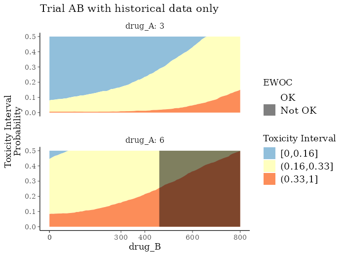
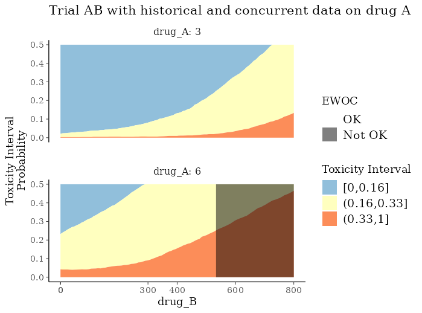
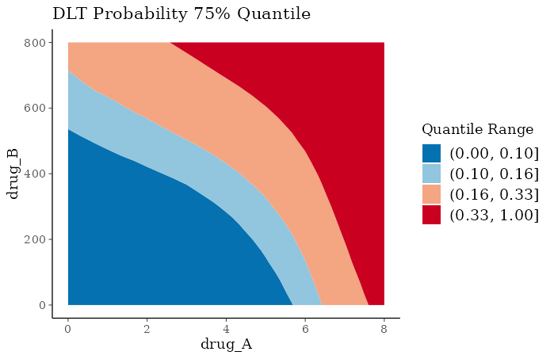

# Guiding Oncology Dose-Escalation Trials

## Introduction

The `OncoBayes2` package provides flexible functions for Bayesian
meta-analytic modeling of the incidence of Dose Limiting Toxicities
(DLTs) by dose level, under treatment regimes involving any number of
combination partners. Such models may be used to ensure patient safety
during trial conduct by supporting dose-escalation decisions. In
addition, the model can support estimation of the Maximum Tolerated Dose
(MTD) in adaptive Bayesian dose-escalation designs.

Whereas traditional dose escalation designs, such as the 3+3 design,
base the dosing decisions on predefined rules about the number of DLTs
in the last one or two cohorts at the current dose, model-based designs
such as those using Bayesian Logistic Regression Models (BLRMs) endeavor
to model the dose-toxicity relationship as a continuous curve, and allow
the model to guide dosing decisions. In this way, all available data
contributes to the dosing decisions. Furthermore, extensions to the BLRM
approach can support inclusion of available additional data on the
compound(s) involved. The additional data can be either historical data
collected prior trial conduct or concurrent data, which is collected
during trial conduct in the context of another trial/context.

The package supports incorporation of additional data through a
Meta-Analytic-Combined (MAC) framework \[1\]. Within the MAC model the
heterogeneous sources of data are assigned to *groups* and information
is shared across groups through a hierarchical model structure. For any
given group this leads to borrowing strength from all other groups while
discounting the information from other groups. The amount of discounting
(or down-weighting) is determined by the heterogeneity. A group is
commonly defined to be a trial, but that must not necessarily hold.

The key assumption of the hierarchical model is the exchangability
assumption between the groups. There are two independent mechanisms in
the package which aim at relaxing the exchangability assumption:

- Differential discounting: Groups are assigned to different strata.
  While the overall hierarchical mean stays the same, the heterogeneity
  between groups is allowed to be different between strata. Each group
  must be assigned to a single stratum only.

- EXchangeable/Non-EXchangeable (EX/NEX) model for each group: With
  EXNEX each group is modelled as being exchangeable with some
  probability and is allowed to have it’s own group-specific estimate as
  if the group is not exchangeable with the remainder of the data.

Both techniques are rather advanced and are not discussed further in
this introduction.

In the following we illustrate first a very common use case of
historical information only and then consider concurrent data in
addition. In particular, we will discuss a trial evaluating a
combination of two drugs whenever historical information is available on
each drug individually from separate trials. This example will be
expanded by using in addition concurrent data on one of the drugs and on
their combination.

**Note on terminology:** While in the literature (see \[1\], \[2\], and
\[4\]) the term *stratum* refers to a trial commonly, `OncoBayes2`
deviates here and uses the term *group* instead. This is more in line
with hierarchical modeling terminology. The term *stratum* is used to
define a higher level grouping structure. That is, every group is
assigned to a single *stratum* within `OncoBayes2`. This higher level
grouping (groups of groups) is necessary whenever differential
discounting is used. By convention `OncoBayes2` assigns any group to the
stratum “all” whenever no stratum is assigned for a group.

``` r
## Load involved packages
library(RBesT)   ## used to define priors
library(dplyr)   ## for mutate
library(tidyr)   ## defines expand_grid
library(tibble)  ## for tibbles
library(ggplot2) ## for plotting
```

## Example use-case: Dual combination trial with historical information

Consider the application described in Section 3.2 of \[1\], in which the
risk of DLT is to be studied as a function of dose for two drugs, drug A
and drug B. Historical information on the toxicity profiles of these two
drugs is available from single agent trials `trial_A` and `trial_B`. The
historical data for this example is available in an internal data set.

``` r
kable(hist_combo2)
```

| group_id | drug_A | drug_B | num_patients | num_toxicities | cohort_time |
|:---------|-------:|-------:|-------------:|---------------:|------------:|
| trial_A  |    3.0 |    0.0 |            3 |              0 |           0 |
| trial_A  |    4.5 |    0.0 |            3 |              0 |           0 |
| trial_A  |    6.0 |    0.0 |            6 |              0 |           0 |
| trial_A  |    8.0 |    0.0 |            3 |              2 |           0 |
| trial_B  |    0.0 |   33.3 |            3 |              0 |           0 |
| trial_B  |    0.0 |   50.0 |            3 |              0 |           0 |
| trial_B  |    0.0 |  100.0 |            4 |              0 |           0 |
| trial_B  |    0.0 |  200.0 |            9 |              0 |           0 |
| trial_B  |    0.0 |  400.0 |           15 |              0 |           0 |
| trial_B  |    0.0 |  800.0 |           20 |              2 |           0 |
| trial_B  |    0.0 | 1120.0 |           17 |              4 |           0 |

The objective is to aid dosing and dose-escalation decisions in a future
trial, `trial_AB`, in which the drugs will be combined. Additionally,
another investigator-initiated trial `IIT` will study the same
combination concurrently. Note that these as-yet-unobserved sources of
data are included in the input data as unobserved factor levels. This
mechanism allows us to specify a joint meta-analytic prior for all four
sources of historical and concurrent data.

``` r
levels(hist_combo2$group_id)
```

    ## [1] "trial_A"  "trial_B"  "IIT"      "trial_AB"

However, we will first consider only the dual combination trial AB and
it’s historical data and add concurrent data at a later stage.

### Setting up the trial design

The function `blrm_trial` provides an object-oriented framework for
operationalizing the dose-escalation trial design. This framework is
intended as a convenient wrapper for the main model-fitting engine of
the package, the
[`blrm_exnex()`](https://opensource.nibr.com/OncoBayes2/reference/blrm_exnex.md)
function. The latter allows additional flexibility for specifying the
functional form of the model, but `blrm_trial` covers the most common
use-cases. This introductory vignette highlights `blrm_trial` in lieu of
`blrm_exnex`; the reader is referred to the help-page of the
function[`?blrm_exnex`](https://opensource.nibr.com/OncoBayes2/reference/blrm_exnex.md)
for more details.

One begins with `blrm_trial` by specifying three key design elements:

- The historical dose-toxicity data
- Information about the study drugs
- The provisional dose levels to be studied during the escalation trial

Information about the study drugs is encoded through a `tibble` as
below. This includes the names of the study-drugs, the reference doses
(see \[3\] or
[`?blrm_exnex`](https://opensource.nibr.com/OncoBayes2/reference/blrm_exnex.md)
to understand the role this choice plays in the model specification),
the dosing units, and (optionally) the a priori expected DLT rate for
each study drug given individually at the respective reference doses.

All design information for the study described in \[1\] is also included
as built-in datasets, which are part of the `OncoBayes2` package.

#### Drug info

``` r
kable(drug_info_combo2)
```

| drug_name | dose_ref | dose_unit | reference_p_dlt |
|:----------|---------:|:----------|----------------:|
| drug_A    |        6 | mg        |             0.2 |
| drug_B    |     1500 | mg        |             0.2 |

#### Dose info

The provisional dose levels are specified as below. For conciseness, we
limit the dose level of in these provisional doses.

``` r
dose_info <- filter(
  dose_info_combo2, group_id == "trial_AB",
  drug_A %in% c(3, 6), drug_B %in% c(0, 400, 800)
)
kable(dose_info)
```

| group_id | drug_A | drug_B | dose_id |
|:---------|-------:|-------:|--------:|
| trial_AB |      3 |      0 |      27 |
| trial_AB |      3 |    400 |      28 |
| trial_AB |      3 |    800 |      30 |
| trial_AB |      6 |      0 |      35 |
| trial_AB |      6 |    400 |      36 |
| trial_AB |      6 |    800 |      38 |

#### Initializing a `blrm_trial`

Together with the data described in the previous section, these objects
can be used to initialize a `blrm_trial` object.

``` r
combo2_trial_setup <- blrm_trial(
  data = hist_combo2,
  drug_info = drug_info_combo2,
  dose_info = dose_info
)
```

    ## No stratum defined - assigning all groups to single stratum "all"

    ## Please configure blrm_exnex using the update() function.

### Specifying the prior and fitting the model

At this point, the trial design has been initialized. However, in the
absence of `simplified_prior = TRUE`, we have not yet specified the
prior distribution for the dose-toxicity model.

OncoBayes2 provides two methods for completing the model specification:

1.  Use `simplified_prior = TRUE`, which employs a package-default prior
    distribution, subject to a small number of optional arguments
    controlling the details.

2.  Provide a full prior specification to be passed to the `blrm_exnex`
    function.

For simplicity and conciseness purposes, here we use method \#1, which
is not recommended for actual trials as the prior should be chosen
deliberately and there is no guarantee that the simplified prior will
remain stable across releases of the package. See
[`?'example-combo2_trial'`](https://opensource.nibr.com/OncoBayes2/reference/example-combo2_trial.md)
for an example of \#2. The below choice of prior broadly follows the
case study in \[4\], although we slightly deviate from the model in
\[4\] by a different reference dose and mean reference DLT rate.

To employ the simplified prior, and fit the model with MCMC:

``` r
combo2_trial_start <- blrm_trial(
  data = hist_combo2,
  drug_info = drug_info_combo2,
  dose_info = dose_info,
  simplified_prior = TRUE,
  EXNEX_comp = FALSE,
  EX_prob_comp_hist = 1,
  EX_prob_comp_new = 1
)
```

    ## Warning in .blrm_trial_compute_simple_prior(object = trial, EXNEX_comp =
    ## EXNEX_comp, : Simplified prior CAN and WILL change with releases. NOT
    ## recommended to use in production. Instantiating a simplified prior - run
    ## summary(trial, "blrm_exnex_call") to inspect arguments.

    ## Warning: There were 1 divergent transitions after warmup. See
    ## https://mc-stan.org/misc/warnings.html#divergent-transitions-after-warmup
    ## to find out why this is a problem and how to eliminate them.

    ## Warning: Examine the pairs() plot to diagnose sampling problems

    ## Warning: 1 out of 6 ewoc metrics are within the 95% MCMC error of the decision boundary.
    ## Be careful when using the imprecise ewoc estimates! It is recommended to run
    ## more iterations and review doses close to critical thresholds.
    ## You may call "summary(trial, summarize='ewoc_check', ...)" for more diagnostic details.
    ## Please call "help('blrm_trial', help_type='summary')" for further documentation.

Now, the object `combo2_trial_start` contains the posterior model fit at
the start of the trial, in addition to the trial design details. Next we
highlight the main methods for extracting relevant information from it.

### Summary of prior specification

The function `prior_summary` provides a facility for printing, in a
readable format, a summary of the prior specification.

``` r
prior_summary(combo2_trial_start) # not run here
```

### Summary of posterior

The main target of inference is generally the probability of DLT at a
selection of provisional dose levels. To obtain these summaries for the
provisional doses specified previously, we simply write:

``` r
kable(summary(combo2_trial_start, "dose_prediction"), digits = 2)
```

| group_id | drug_A | drug_B | dose_id | stratum_id | mean |   sd | 2.5% |  50% | 97.5% | prob_underdose | prob_target | prob_overdose | ewoc_ok |
|:---------|-------:|-------:|--------:|:-----------|-----:|-----:|-----:|-----:|------:|---------------:|------------:|--------------:|:--------|
| trial_AB |      3 |      0 |      27 | all        | 0.08 | 0.14 | 0.00 | 0.04 |  0.52 |           0.88 |        0.07 |          0.04 | TRUE    |
| trial_AB |      3 |    400 |      28 | all        | 0.14 | 0.17 | 0.01 | 0.09 |  0.72 |           0.74 |        0.17 |          0.09 | TRUE    |
| trial_AB |      3 |    800 |      30 | all        | 0.21 | 0.20 | 0.02 | 0.15 |  0.85 |           0.53 |        0.29 |          0.18 | TRUE    |
| trial_AB |      6 |      0 |      35 | all        | 0.18 | 0.17 | 0.01 | 0.14 |  0.77 |           0.58 |        0.29 |          0.13 | TRUE    |
| trial_AB |      6 |    400 |      36 | all        | 0.24 | 0.21 | 0.02 | 0.18 |  0.91 |           0.45 |        0.31 |          0.24 | TRUE    |
| trial_AB |      6 |    800 |      38 | all        | 0.32 | 0.25 | 0.02 | 0.24 |  0.94 |           0.36 |        0.26 |          0.39 | FALSE   |

Such summaries may be used to assess which combination doses have
unacceptable high risk of toxicity. For example, according to the
escalation with overdose control (EWOC) design criteria \[3\], one would
compute the posterior probability that each dose is excessively toxic
(column `prob_overdose`; note that the definition of “excessively toxic”
is encoded in the `blrm_trial` object through the `interval_prob`
argument), and take as eligible doses only those where this probability
does not exceed 25% (column `ewoc_ok`).

### Posterior accuracy of EWOC estimation

Since the posterior is represented with a large sample of the target
density, any estimate derived from it is subject to finite sampling
error. The sampling error is determined by the posterior sample size and
the quality of the used Markov chain Monte Carlo (MCMC). Hence, it is
required to ensure that the MCMC chains have converged and that the
number of samples representing the posterior is large enough to estimate
desired quantities of interest with sufficient accuracy. The
`OncoBayes2` package automatically warns in case of non-convergence as
indicated by the Rhat diagnostic \[5\]. All model parameters must have
an Rhat of less than $1.1$ (values much larger than $1.0$ indicate
non-convergence).

As the primary objective for a BLRM is to determine a safe set of doses
via estimation of EWOC, the key quantities defining EWOC are monitored
for convergence and sufficient accuracy for each pre-defined dose as
well. These diagnostics can be obtained for the pre-defined set of doses
via the `ewoc_check` summary routine as:

``` r
kable(summary(combo2_trial_start, "ewoc_check"), digits = 3)
```

    ## Warning: 1 out of 6 ewoc metrics are within the 95% MCMC error of the decision boundary.
    ## Be careful when using the imprecise ewoc estimates! It is recommended to run
    ## more iterations and review doses close to critical thresholds.
    ## You may call "summary(trial, summarize='ewoc_check', ...)" for more diagnostic details.
    ## Please call "help('blrm_trial', help_type='summary')" for further documentation.

| group_id | drug_A | drug_B | dose_id | stratum_id | prob_overdose_est | prob_overdose_stat | prob_overdose_mcse | prob_overdose_ess | prob_overdose_rhat |
|:---------|-------:|-------:|--------:|:-----------|------------------:|-------------------:|-------------------:|------------------:|-------------------:|
| trial_AB |      3 |      0 |      27 | all        |             0.093 |            -60.245 |              0.004 |          1898.087 |              1.000 |
| trial_AB |      3 |    400 |      28 | all        |             0.164 |            -41.309 |              0.004 |          1924.781 |              1.001 |
| trial_AB |      3 |    800 |      30 | all        |             0.275 |             -8.714 |              0.006 |          1650.808 |              1.000 |
| trial_AB |      6 |      0 |      35 | all        |             0.230 |            -17.027 |              0.006 |          2026.784 |              1.002 |
| trial_AB |      6 |    400 |      36 | all        |             0.322 |             -1.165 |              0.007 |          1984.089 |              1.002 |
| trial_AB |      6 |    800 |      38 | all        |             0.463 |             13.750 |              0.010 |          2092.806 |              1.002 |

For the standard EWOC criterion, the `prob_overdose_est` column contains
the 75% quantile of the posterior DLT probability, which must be smaller
than 33%. The `prob_overdose_stat` column is centered by 33% and
standardized with the Monte-Carlo standard error (mcse). Therefore,
negative values correspond to safe doses and since the quantity is
approximately distributed as a standard normal random variate, the
statistic can be compared with quantiles of the standard normal
distribution. `OncoBayes2` will warn for an imprecise EWOC estimate
whenever the statistic is within the range of the central 95% interval
of $( - 1.96,1.96)$. Whenever this occurs it can be useful to increase
the number of iterations in order to decrease the mcse, which scales
with the inverse of the square root of the MC ess. The MC ess is the
number of independent samples the posterior corresponds to (recall that
MCMC results in correlated samples). For more information please refer
to the help of the `summary.blrm_trial` function (see
[`help("blrm_trial", help_type="summary")`](https://opensource.nibr.com/OncoBayes2/reference/blrm_trial.md)).

We can see that for the pre-defined doses of the trial the EWOC decision
can be determined with more than enough accuracy given that the
statistic closest to $0$ is $- 1.17$.

### Posterior predictive summaries

The BLRM allows a principled approach to predicting the number of DLTs
that may be observed in a future cohort. This may be a key estimand for
understanding and limiting the toxicity risk to patients. For example,
suppose a candidate starting dose for the new trial `trial_AB` is 3 mg
of drug A + 400 mg of drug B. We may wish to check that at this dose,
the predictive probability of 2 or more DLTs out of an initial cohort of
3 to 6 patients is sufficiently low.

``` r
candidate_starting_dose <- summary(combo2_trial_start, "dose_info") |>
  filter(drug_A == 3, drug_B == 400) |>
  crossing(num_toxicities = 0, num_patients = 3:6)

pp_summary <- summary(combo2_trial_start,
  interval_prob = c(-1, 0, 1, 6), predictive = TRUE,
  newdata = candidate_starting_dose
)

kable(bind_cols(
  select(candidate_starting_dose, num_patients),
  select(pp_summary, ends_with("]"))
), digits = 3)
```

| num_patients | (-1,0\] | (0,1\] | (1,6\] |
|-------------:|--------:|-------:|-------:|
|            3 |   0.696 |  0.217 |  0.087 |
|            4 |   0.636 |  0.239 |  0.125 |
|            5 |   0.586 |  0.253 |  0.162 |
|            6 |   0.542 |  0.261 |  0.197 |

This tells us that for the initial cohort, according to the model, the
chance of two or more patients developing DLTs ranges from 8.7% to
19.7%, depending on the number of patients enrolled.

### Updating the model with new data

Dose-escalation designs are adaptive in nature, as dosing decisions are
made after each sequential cohort. The model must be updated with the
accrued data for each dose escalation decision point. If a new cohort of
patients is observed, say:

``` r
new_cohort <- tibble(
  group_id = "trial_AB",
  drug_A = 3,
  drug_B = 400,
  num_patients = 5,
  num_toxicities = 1
)
```

One can update the model to incorporate this new information using
[`update()`](https://rdrr.io/r/stats/update.html) with `add_data` equal
to the new cohort:

``` r
combo2_trial_update <- update(combo2_trial_start, add_data = new_cohort)
```

    ## Warning: 1 out of 6 ewoc metrics are within the 95% MCMC error of the decision boundary.
    ## Be careful when using the imprecise ewoc estimates! It is recommended to run
    ## more iterations and review doses close to critical thresholds.
    ## You may call "summary(trial, summarize='ewoc_check', ...)" for more diagnostic details.
    ## Please call "help('blrm_trial', help_type='summary')" for further documentation.

This yields a new `blrm_trial` object with updated data and posterior
summaries. Obtaining the summaries for the pre-planned provisional doses
is then again straightforward:

``` r
kable(summary(combo2_trial_update, "dose_prediction"), digits = 2)
```

| group_id | drug_A | drug_B | dose_id | stratum_id | mean |   sd | 2.5% |  50% | 97.5% | prob_underdose | prob_target | prob_overdose | ewoc_ok |
|:---------|-------:|-------:|--------:|:-----------|-----:|-----:|-----:|-----:|------:|---------------:|------------:|--------------:|:--------|
| trial_AB |      3 |      0 |      27 | all        | 0.08 | 0.08 | 0.00 | 0.06 |  0.27 |           0.89 |        0.10 |          0.01 | TRUE    |
| trial_AB |      3 |    400 |      28 | all        | 0.14 | 0.09 | 0.02 | 0.12 |  0.37 |           0.68 |        0.27 |          0.04 | TRUE    |
| trial_AB |      3 |    800 |      30 | all        | 0.23 | 0.15 | 0.04 | 0.20 |  0.58 |           0.38 |        0.40 |          0.22 | TRUE    |
| trial_AB |      6 |      0 |      35 | all        | 0.18 | 0.13 | 0.01 | 0.15 |  0.49 |           0.53 |        0.37 |          0.10 | TRUE    |
| trial_AB |      6 |    400 |      36 | all        | 0.25 | 0.16 | 0.04 | 0.22 |  0.61 |           0.34 |        0.39 |          0.27 | FALSE   |
| trial_AB |      6 |    800 |      38 | all        | 0.34 | 0.22 | 0.04 | 0.30 |  0.82 |           0.25 |        0.30 |          0.46 | FALSE   |

In case posterior summaries are needed for doses other than the
pre-planned ones, then this is possible using the `newdata_prediction`
functionality, which allows to specify a different set of doses via the
`newdata` argument:

``` r
kable(summary(combo2_trial_update, "newdata_prediction",
  newdata = tibble(
    group_id = "trial_AB",
    drug_A = 4.5,
    drug_B = c(400, 600, 800)
  )
), digits = 2)
```

    ## stratum_id not given, but only one stratum defined. Assigning first stratum.

| group_id | drug_A | drug_B | stratum_id | dose_id | mean |   sd | 2.5% |  50% | 97.5% | prob_underdose | prob_target | prob_overdose | ewoc_ok |
|:---------|-------:|-------:|:-----------|--------:|-----:|-----:|-----:|-----:|------:|---------------:|------------:|--------------:|:--------|
| trial_AB |    4.5 |    400 | all        |      NA | 0.19 | 0.12 | 0.03 | 0.16 |  0.48 |           0.49 |        0.38 |          0.13 | TRUE    |
| trial_AB |    4.5 |    600 | all        |      NA | 0.23 | 0.15 | 0.04 | 0.20 |  0.59 |           0.38 |        0.38 |          0.24 | TRUE    |
| trial_AB |    4.5 |    800 | all        |      NA | 0.28 | 0.18 | 0.04 | 0.24 |  0.71 |           0.29 |        0.37 |          0.34 | FALSE   |

### Data scenarios

It may be of interest to test prospectively how this model responds in
various scenarios for upcoming cohorts.

This can be done easily by again using
[`update()`](https://rdrr.io/r/stats/update.html) with the `add_data`
argument. In the code below, we explore 3 possible outcomes for a
subsequent cohort enrolled at 3 mg drug A + 800 mg drug B, and review
the model’s inference at adjacent doses.

``` r
# set up two scenarios at the starting dose level
# store them as data frames in a named list
scenarios <- expand_grid(
  group_id = "trial_AB",
  drug_A = 3,
  drug_B = 800,
  num_patients = 3,
  num_toxicities = 0:2
) |>
  split(1:3) |>
  setNames(paste0(0:2, "/3 DLTs"))

candidate_doses <- expand_grid(
  group_id = "trial_AB",
  drug_A = c(3, 4.5),
  drug_B = c(600, 800)
)

scenario_inference <- lapply(scenarios, function(scenario_newdata) {
  # refit the model with each scenario's additional data
  scenario_fit <- update(combo2_trial_update, add_data = scenario_newdata)
  # summarize posterior at candidate doses
  summary(scenario_fit, "newdata_prediction", newdata = candidate_doses)
}) |>
  bind_rows(.id = "Scenario")
```

    ## Warning: There were 1 divergent transitions after warmup. See
    ## https://mc-stan.org/misc/warnings.html#divergent-transitions-after-warmup
    ## to find out why this is a problem and how to eliminate them.

    ## Warning: Examine the pairs() plot to diagnose sampling problems

    ## Warning: 1 out of 6 ewoc metrics are within the 95% MCMC error of the decision boundary.
    ## Be careful when using the imprecise ewoc estimates! It is recommended to run
    ## more iterations and review doses close to critical thresholds.
    ## You may call "summary(trial, summarize='ewoc_check', ...)" for more diagnostic details.
    ## Please call "help('blrm_trial', help_type='summary')" for further documentation.

| Scenario | drug_A | drug_B | mean |   sd | 2.5% |  50% | 97.5% | prob_underdose | prob_target | prob_overdose | ewoc_ok |
|:---------|-------:|-------:|-----:|-----:|-----:|-----:|------:|---------------:|------------:|--------------:|:--------|
| 0/3 DLTs |    3.0 |    600 | 0.13 | 0.08 | 0.02 | 0.12 |  0.34 |           0.70 |        0.27 |          0.03 | TRUE    |
| 0/3 DLTs |    3.0 |    800 | 0.17 | 0.10 | 0.03 | 0.15 |  0.42 |           0.55 |        0.37 |          0.08 | TRUE    |
| 0/3 DLTs |    4.5 |    600 | 0.17 | 0.11 | 0.03 | 0.15 |  0.45 |           0.53 |        0.37 |          0.10 | TRUE    |
| 0/3 DLTs |    4.5 |    800 | 0.21 | 0.14 | 0.03 | 0.18 |  0.56 |           0.44 |        0.39 |          0.17 | TRUE    |
| 1/3 DLTs |    3.0 |    600 | 0.20 | 0.10 | 0.05 | 0.18 |  0.44 |           0.42 |        0.47 |          0.11 | TRUE    |
| 1/3 DLTs |    3.0 |    800 | 0.25 | 0.13 | 0.06 | 0.23 |  0.55 |           0.26 |        0.50 |          0.24 | TRUE    |
| 1/3 DLTs |    4.5 |    600 | 0.26 | 0.14 | 0.06 | 0.24 |  0.59 |           0.27 |        0.46 |          0.28 | FALSE   |
| 1/3 DLTs |    4.5 |    800 | 0.32 | 0.17 | 0.07 | 0.29 |  0.69 |           0.19 |        0.38 |          0.43 | FALSE   |
| 2/3 DLTs |    3.0 |    600 | 0.28 | 0.13 | 0.08 | 0.26 |  0.60 |           0.19 |        0.50 |          0.31 | FALSE   |
| 2/3 DLTs |    3.0 |    800 | 0.36 | 0.16 | 0.11 | 0.34 |  0.73 |           0.08 |        0.40 |          0.52 | FALSE   |
| 2/3 DLTs |    4.5 |    600 | 0.36 | 0.16 | 0.10 | 0.34 |  0.72 |           0.10 |        0.38 |          0.53 | FALSE   |
| 2/3 DLTs |    4.5 |    800 | 0.44 | 0.19 | 0.12 | 0.43 |  0.82 |           0.06 |        0.26 |          0.68 | FALSE   |

Model inference for trial AB when varying hypothetical DLT scenarios for
a cohort of size 3

## Continuation of example: Using concurrent data

In the example of \[1\], at the time of completion of the first stage of
`trial_AB`, the following additional data was observed.

``` r
trial_AB_data <- filter(codata_combo2, group_id == "trial_AB", cohort_time == 1)
kable(trial_AB_data)
```

| group_id | drug_A | drug_B | num_patients | num_toxicities | cohort_time |
|:---------|-------:|-------:|-------------:|---------------:|------------:|
| trial_AB |      3 |    400 |            3 |              0 |           1 |
| trial_AB |      3 |    800 |            3 |              1 |           1 |
| trial_AB |      6 |    400 |            3 |              1 |           1 |

These data are easily incorporated into the model using another call to
`update`, as below.

``` r
combo2_trial_histdata <- update(combo2_trial_start, add_data = trial_AB_data)
```

However, during the first stage of `trial_AB`, the `trial_A` studying
drug A did continue and collected more data on the drug A dose-toxicity
relationship:

``` r
trial_A_codata <- filter(codata_combo2, group_id == "trial_A", cohort_time == 1)
kable(trial_A_codata)
```

| group_id | drug_A | drug_B | num_patients | num_toxicities | cohort_time |
|:---------|-------:|-------:|-------------:|---------------:|------------:|
| trial_A  |    3.0 |      0 |            3 |              0 |           1 |
| trial_A  |    4.5 |      0 |            6 |              0 |           1 |
| trial_A  |    6.0 |      0 |           11 |              0 |           1 |
| trial_A  |    8.0 |      0 |            3 |              2 |           1 |

Wthin the MAC framework we may simply add the concurrent data to our
overall model which yields refined predictions for future cohorts.

``` r
combo2_trial_codata <- update(combo2_trial_histdata, add_data = trial_A_codata)
```

    ## Warning in .blrm_trial_sanitize_data(trial = trial, data = args[["add_data"]]):
    ## Data that was provided does not correspond to a pre-specified dose!

To compare the effect of co-data in this case it is simplest to
visualize the interval probabilities as predicted by the model for the
different data constellations. Here we use the function
`plot_toxicity_intervals_stacked` to explore the dose-toxicity
relationship in a continuous manner in terms of the dose.

``` r
plot_toxicity_intervals_stacked(combo2_trial_histdata,
  newdata = mutate(dose_info, dose_id = NULL, stratum_id = "all"),
  x = vars(drug_B),
  group = vars(drug_A),
  facet_args = list(ncol = 1)
) + ggtitle("Trial AB with historical data only")
```



``` r
plot_toxicity_intervals_stacked(combo2_trial_codata,
  newdata = mutate(dose_info, dose_id = NULL, stratum_id = "all"),
  x = vars(drug_B),
  group = vars(drug_A),
  facet_args = list(ncol = 1)
) + ggtitle("Trial AB with historical and concurrent data on drug A")
```



As we can observe, the additional data on drug A moves the maximal
admissible dose allowed by EWOC towards higher doses for drug B whenever
drug A is 6 mg. This reflects that drug A has been observed to be
relatively safe, since no DLT was observed for a number of doses.

In the example of \[1\], during the conduct of the second stage of the
`trial_AB` an additional external data source from a new trial became
available. This time it is stemming from another trial which is an
investigator-initiated trial `IIT` of the same combination. Numerous
toxicities were observed in this concurrent study as stage 2 of
`trial_AB`.

``` r
trial_AB_stage_2_codata <- filter(codata_combo2, cohort_time == 2)
kable(trial_AB_stage_2_codata)
```

| group_id | drug_A | drug_B | num_patients | num_toxicities | cohort_time |
|:---------|-------:|-------:|-------------:|---------------:|------------:|
| IIT      |    3.0 |    400 |            3 |              0 |           2 |
| IIT      |    3.0 |    800 |            7 |              5 |           2 |
| IIT      |    4.5 |    400 |            3 |              0 |           2 |
| IIT      |    6.0 |    400 |            6 |              0 |           2 |
| IIT      |    6.0 |    600 |            3 |              2 |           2 |
| trial_AB |    3.0 |    400 |            3 |              0 |           2 |
| trial_AB |    3.0 |    800 |            6 |              2 |           2 |
| trial_AB |    4.5 |    600 |           10 |              2 |           2 |
| trial_AB |    6.0 |    400 |           10 |              3 |           2 |

As before, through the MAC framework, these data can influence the model
summaries for `trial_AB`. We leave it to the reader to explore the
differences in the co-data (combined historical and concurrent data) vs
the historical data only approach.

To conclude we present a graphical summary of the dose-toxicity
relationship for the dual combination trial for the final data
constellation. Note that we use the `data` option of `update` here to
ensure that we use an entirely new dataset which includes all data
collected; so this includes historical, trial and concurrent data:

``` r
combo2_trial_final <- update(combo2_trial_start, data = codata_combo2)
```

    ## Warning in .blrm_trial_sanitize_data(trial = trial, data = args[["data"]]):
    ## Data that was provided does not correspond to a pre-specified dose!

    ## Warning: There were 2 divergent transitions after warmup. See
    ## https://mc-stan.org/misc/warnings.html#divergent-transitions-after-warmup
    ## to find out why this is a problem and how to eliminate them.

    ## Warning: Examine the pairs() plot to diagnose sampling problems

As final summary we consider the 75% quantile of the probability for a
DLT at all dose combinations. Whenever the 75% quantile exceeds 33%,
then the EWOC criterion is violated and the dose is too toxic.

``` r
grid_length <- 25

dose_info_plot_grid <- expand_grid(
  stratum_id = "all",
  group_id = "trial_AB",
  drug_A = seq(min(dose_info_combo2$drug_A),
               max(dose_info_combo2$drug_A),
               length.out = grid_length),
  drug_B = seq(min(dose_info_combo2$drug_B),
               max(dose_info_combo2$drug_B),
               length.out = grid_length)
)


dose_info_plot_grid_sum <- summary(combo2_trial_final,
  newdata = dose_info_plot_grid,
  prob = 0.5
)

ggplot(dose_info_plot_grid_sum, aes(drug_A, drug_B, z = !!as.name("75%"))) +
  geom_contour_filled(breaks = c(0, 0.1, 0.16, 0.33, 1)) +
  scale_fill_brewer("Quantile Range", type = "div", palette = "RdBu", direction = -1) +
  ggtitle("DLT Probability 75% Quantile")
```



## References

\[1\] Neuenschwander, B., Roychoudhury, S., & Schmidli, H. (2016). On
the use of co-data in clinical trials. Statistics in Biopharmaceutical
Research, 8(3), 345-354.

\[2\] Neuenschwander, B., Wandel, S., Roychoudhury, S., & Bailey, S.
(2016). Robust exchangeability designs for early phase clinical trials
with multiple strata. Pharmaceutical statistics, 15(2), 123-134.

\[3\] Neuenschwander, B., Branson, M., & Gsponer, T. (2008). Critical
aspects of the Bayesian approach to phase I cancer trials. Statistics in
medicine, 27(13), 2420-2439.

\[4\] Neuenschwander, B., Matano, A., Tang, Z., Roychoudhury, S.,
Wandel, S. Bailey, Stuart. (2014). A Bayesian Industry Approach to Phase
I Combination Trials in Oncology. In Statistical methods in drug
combination studies (Vol. 69). CRC Press.

\[5\] Vehtari, A., Gelman, A., Simpson, D., Carpenter, B., Bürkner, P.
C. (2021). Rank-Normalization, Folding, and Localization: An Improved
($\widehat{R}$) for Assessing Convergence of MCMC, Bayesian Analysis, 16
(2), 667–718. <https://doi.org/10.1214/20-BA1221>

## Session Info

``` r
sessionInfo()
```

    ## R version 4.5.2 (2025-10-31)
    ## Platform: x86_64-pc-linux-gnu
    ## Running under: Ubuntu 24.04.3 LTS
    ## 
    ## Matrix products: default
    ## BLAS:   /usr/lib/x86_64-linux-gnu/openblas-pthread/libblas.so.3 
    ## LAPACK: /usr/lib/x86_64-linux-gnu/openblas-pthread/libopenblasp-r0.3.26.so;  LAPACK version 3.12.0
    ## 
    ## locale:
    ##  [1] LC_CTYPE=C.UTF-8       LC_NUMERIC=C           LC_TIME=C.UTF-8       
    ##  [4] LC_COLLATE=C.UTF-8     LC_MONETARY=C.UTF-8    LC_MESSAGES=C.UTF-8   
    ##  [7] LC_PAPER=C.UTF-8       LC_NAME=C              LC_ADDRESS=C          
    ## [10] LC_TELEPHONE=C         LC_MEASUREMENT=C.UTF-8 LC_IDENTIFICATION=C   
    ## 
    ## time zone: UTC
    ## tzcode source: system (glibc)
    ## 
    ## attached base packages:
    ## [1] stats     graphics  grDevices utils     datasets  methods   base     
    ## 
    ## other attached packages:
    ## [1] tibble_3.3.0     ggplot2_4.0.1    knitr_1.50       tidyr_1.3.1     
    ## [5] dplyr_1.1.4      posterior_1.6.1  OncoBayes2_0.9-4 RBesT_1.8-2     
    ## 
    ## loaded via a namespace (and not attached):
    ##  [1] tensorA_0.36.2.1      sass_0.4.10           generics_0.1.4       
    ##  [4] digest_0.6.39         magrittr_2.0.4        evaluate_1.0.5       
    ##  [7] grid_4.5.2            RColorBrewer_1.1-3    mvtnorm_1.3-3        
    ## [10] fastmap_1.2.0         jsonlite_2.0.0        pkgbuild_1.4.8       
    ## [13] backports_1.5.0       Formula_1.2-5         gridExtra_2.3        
    ## [16] purrr_1.2.0           QuickJSR_1.8.1        scales_1.4.0         
    ## [19] isoband_0.3.0         codetools_0.2-20      textshaping_1.0.4    
    ## [22] jquerylib_0.1.4       abind_1.4-8           cli_3.6.5            
    ## [25] rlang_1.1.6           withr_3.0.2           cachem_1.1.0         
    ## [28] yaml_2.3.12           StanHeaders_2.32.10   parallel_4.5.2       
    ## [31] tools_4.5.2           rstan_2.32.7          inline_0.3.21        
    ## [34] rstantools_2.5.0      checkmate_2.3.3       assertthat_0.2.1     
    ## [37] vctrs_0.6.5           R6_2.6.1              matrixStats_1.5.0    
    ## [40] stats4_4.5.2          lifecycle_1.0.4       fs_1.6.6             
    ## [43] ragg_1.5.0            pkgconfig_2.0.3       desc_1.4.3           
    ## [46] pkgdown_2.2.0         RcppParallel_5.1.11-1 pillar_1.11.1        
    ## [49] bslib_0.9.0           gtable_0.3.6          loo_2.8.0            
    ## [52] glue_1.8.0            Rcpp_1.1.0            systemfonts_1.3.1    
    ## [55] xfun_0.55             tidyselect_1.2.1      bayesplot_1.15.0     
    ## [58] farver_2.1.2          htmltools_0.5.9       labeling_0.4.3       
    ## [61] rmarkdown_2.30        compiler_4.5.2        S7_0.2.1             
    ## [64] distributional_0.5.0
