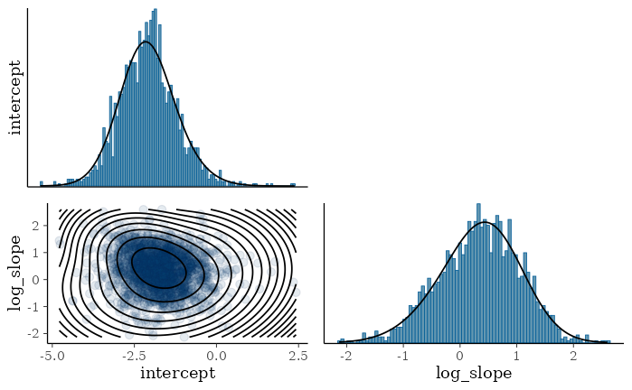
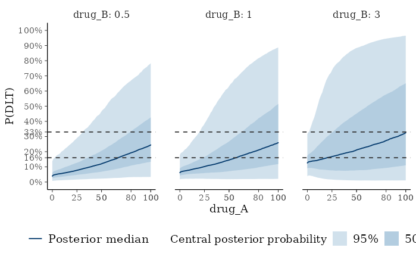

# Meta-Analytic-Predictive (MAP) approach for dose-toxicity modelling

## Introduction

A common characteristic of modern applications of the Bayesian Logistic
Regression Model (BLRM) for model-based dose escalation is the
availability of relevant historical data on the study treatment(s). For
example, studies testing novel combination therapies may wish to
incorporate available dose-toxicity data on the individual agents from
single-agent dose escalation trials.

There are two broad categories for statistical approaches to this:

- Meta-Analytic Combined (MAC) approaches use a hierarchical model to
  jointly analyze both the historical data and data from the current
  study. External data from concurrently running trials may also be
  incorporated in such an approach. The [introductory
  vignette](https://opensource.nibr.com/OncoBayes2/articles/introduction.md)
  illustrates this approach.
- Meta-Analytic Predictive (MAP) approaches involve two stages. In the
  first, an initial hierarchical model is estimated from the historical
  data, and from this model one extracts a posterior prediction for the
  trial-level parameters in a future trial. The posterior prediction is
  then approximated in parametric form which is used as MAP prior in the
  future trial.

These two approaches are statistically equivalent to each other
(provided the parametric representation of the MAP prior is exact), but
differ in the “modelling workflow.” While the MAC approach is a
prospective approach enabling to include even concurrent data to borrow
from, the MAP approach is retrospective in that the historical data is
summarized once and usually taken as immutable and static. The MAP
approach has the advantage when designing prospectively a future study
that we can pre-specify (and hence document in a statistical analysis
plan) the information borrowed from the historical data and the model
used for the future study becomes structurally simpler, since there is
often no more a need for a hierarchical model structure at that stage.

The recommended reference for more details on these approaches, how they
relate to each other, and how they are applied in the dose-toxicity
setting is explained in Neuenschwander et al (2016).

In this vignette, we illustrate the implementation of the MAP approach,
and describe its usage for safety monitoring in a realistic application.

Initial R session setup:

``` r

library(OncoBayes2)
library(RBesT)
library(posterior)
library(ggplot2)
library(dplyr)
library(tidyr)
library(knitr)
```

## Application background

We consider a case study involving a Phase-I dose-escalation study of a
combination therapy of two compounds, drug A and drug B, in a population
of adult patients with solid-tumor cancers. The primary objective of the
study was to identify the Maximum Tolerated Dose (MTD) or Recommended
Phase-2 Dose (RP2D) of the combination.

### Historical data

In this application, each of the two compounds had previously been
tested in single-agent Phase-I dose escalation studies. MTDs had been
declared for each drug:

| Drug   | Declared MTD |
|:-------|:-------------|
| Drug A | 100mg        |
| Drug B | 3mg          |

These declarations had been made on the basis of the following
dose-toxicity data from the two single-agent studies.

| Drug A | Evaluable patients | DLTs |
|-------:|-------------------:|-----:|
|   12.5 |                  1 |    0 |
|   25.0 |                  1 |    0 |
|   50.0 |                  3 |    0 |
|   80.0 |                  9 |    1 |
|  100.0 |                 23 |    4 |
|  150.0 |                  3 |    2 |

Historical data from single-agent study of Drug A {.table}

| Drug B dose | Evaluable patients | DLTs |
|------------:|-------------------:|-----:|
|       0.125 |                  2 |    0 |
|       0.250 |                  1 |    0 |
|       0.500 |                  2 |    0 |
|       1.000 |                  2 |    0 |
|       2.000 |                  3 |    1 |
|       2.500 |                  7 |    0 |
|       3.000 |                 12 |    0 |
|       4.000 |                  3 |    1 |

Historical data from single-agent study of Drug B {.table}

These data were understood to be highly relevant for informing prior
beliefs about the single-agent contributions to the combination toxicity
in the planned study. Therefore a MAP approach was taken to develop
priors for the respective parameters - $`\alpha_A`$, $`\beta_A`$,
$`\alpha_B`$, and $`\beta_B`$ which are obtained by a meta-analysis of
the historical data.

## Derivation of MAP priors

In the MAP approach, we begin with meta-analytic hierarchical modelling
of the historical data, accounting for the possibility of between-trial
heterogeneity. It is important to note that this is done even for the
case of a single historical study being available. The information on
the between-trial heterogeneity relies in this case on the priors used
for the heterogeneity. In practice log normal priors for the
heterogeneity parameters based on the following table have worked well
in many situations. The approach is to categorize the degree of
heterogeneity between trials in terms of anticipated differences in the
population and further factors which depend on a specific case:

| Heterogeneity degree | $`\tau_\alpha`$ | $`\tau_\beta`$ |
|:---------------------|----------------:|---------------:|
| small                |           0.125 |         0.0625 |
| moderate             |           0.250 |         0.1250 |
| substantial          |           0.500 |         0.2500 |
| large                |           1.000 |         0.5000 |
| very large           |           2.000 |         1.0000 |

Heterogeneity categorization for intercept $`\alpha`$ and slope
$`\beta`$ {.table}

Here we fit separate models to the historical drug-A and drug-B
single-agent data. Note, equivalently, a single hierarchical
double-combination model without any interaction could have been fit to
those data, and would have produced the same MAP priors for the
drug-level intercepts and slopes. A detailed specification of the models
being fit below is given in the appendix.

In this example we assume that the historical data for drug A comes from
a relatively different population (for example different line of
therapy) and the historical data for drug B stems from a very closely
related patient population. This translates into respective choices for
the between-trial heterogeneity priors according to the table above.

### Drug A model

Implementation of this meta-analysis of single-agent data is done using
[`blrm_exnex()`](https://opensource.nibr.com/OncoBayes2/reference/blrm_exnex.md).
In order to obtain directly a sample of the MAP prior, we set the
`sample_map` argument to `TRUE`.

``` r

# historical data for drug A
hist_A <- data.frame(
  group_id = factor("trial_A"),
  drug_A = c(12.5, 25, 50, 80, 100, 150),
  num_patients = c(1, 1, 3, 9, 23, 3),
  num_toxicities = c(0, 0, 0, 1, 4, 2)
)

# reference dose for drug A
dref_A <- 80

# bivariate normal prior for (intercept, log-slope) 
prior_A <- mixmvnorm(c(1.0,
                       logit(0.2), 0,
                       diag(c(1, (log(4) / 1.96)^2 ))))

# between-trial heterogeneity is centered on "substantial"
tau_substantial_prior <- mixmvnorm(c(1.0,
                                     log(c(0.5, 0.25)),
                                     diag(rep(log(2) / 1.96, 2)^2)))

# fit the model to the historical data
map_model_A <- blrm_exnex(
  cbind(num_toxicities, num_patients - num_toxicities) ~ 
    1 + log(drug_A / dref_A) | 
    0 | 
    group_id,
  data = hist_A,
  prior_EX_mu_comp = list(prior_A),
  prior_EX_tau_comp = tau_substantial_prior,
  prior_EX_prob_comp = matrix(1, nrow = 1, ncol = 1),
  prior_tau_dist = 1,
  sample_map = TRUE
)
```

### Drug B model

Similarly, for drug B:

``` r

# historical data for drug B
hist_B <- data.frame(
  group_id = factor("trial_B"),
  drug_B = c(0.125, 0.25, 0.5, 1, 2, 2.5, 3, 4),
  num_patients = c(2, 1, 2, 2, 3, 7, 12, 3),
  num_toxicities = c(0, 0, 0, 0, 1, 0, 0, 1)
)

# reference dose
dref_B <- 1

# prior for (intercept, log-slope)
prior_B <- prior_A

# between-trial heterogeneity is centered on "small", but with a
# greater degree of uncertainty on this classification
tau_small_prior <- mixmvnorm(c(1.0,
                               log(c(0.125, 0.0625)),
                               diag(rep(log(4) / 1.96, 2)^2)))

# fit model to historical data
map_model_B <- blrm_exnex(
  cbind(num_toxicities, num_patients - num_toxicities) ~ 
    1 + log(drug_B / dref_B) | 
    0 | 
    group_id,
  data = hist_B,
  prior_EX_mu_comp = list(prior_B),
  prior_EX_tau_comp = tau_small_prior,
  prior_EX_prob_comp = matrix(1, nrow = 1, ncol = 1),
  prior_tau_dist = 1,
  sample_map = TRUE
)
```

### Extraction of MAP priors

We now illustrate how these meta-analytic model fits can be used to
produce a parametric MAP prior for the new study intercepts and slopes.

#### MCMC samples

Since we called `blrm_exnex` with the `sample_map=TRUE` argument, the
posterior now contains the respective MAP prior MCMC samples for
`"map_log_beta"` containing for each defined stratum (just one in our
case) the MAP priors in MCMC form for intercept and slope. Here we
extract these as `rvar` variables which simplifies working with the
posterior draws.

``` r

rvar_map_log_beta_A <- as_draws_rvars(map_model_A, variable="map_log_beta")$map_log_beta
rvar_map_log_beta_B <- as_draws_rvars(map_model_B, variable="map_log_beta")$map_log_beta
```

These are posteriors of 3-dimensional arrays with the dimensions
stratum, drug component and coefficient. In the discussed example only a
single stratum and single drug component (per fitted model) is present
such that we directly select the respective entries of the array here
(note that you may use names to access the respective entries in the
array):

``` r

rvar_map_log_beta_A[1,"log(drug_A/dref_A)",,drop=TRUE]
```

    ## rvar<500,4>[2] mean ± sd:
    ##     intercept     log_slope 
    ## -1.73 ± 0.82   0.34 ± 0.72

``` r

rvar_map_log_beta_B[1,"log(drug_B/dref_B)",,drop=TRUE]
```

    ## rvar<500,4>[2] mean ± sd:
    ##     intercept     log_slope 
    ## -2.74 ± 0.62  -0.45 ± 0.53

#### Mixture approximation

In order to leverage these MAP distributions in analyzing the new
combination study data, we need to operationalize them as parametric
prior distributions for the combination model. This is done by
approximating them with finite mixtures of multivariate normal
distributions, handled by the `RBesT` function
[`automixfit()`](https://opensource.nibr.com/RBesT/reference/automixfit.html).
The
[`automixfit()`](https://opensource.nibr.com/RBesT/reference/automixfit.html)
function expects the posterior samples in matrix form such that we
convert the draws accordingly:

``` r

map_mix_A <- automixfit(draws_of(rvar_map_log_beta_A[1,"log(drug_A/dref_A)",,drop=TRUE]),
                        type = "mvnorm")
map_mix_A
```

    ## EM for Multivariate Normal Mixture Model
    ## Log-Likelihood = -4557.01
    ## 
    ## Multivariate normal mixture
    ## Outcome dimension: 2
    ## Mixture Components:
    ##                          comp1       comp2      
    ## w                         0.56206771  0.43793229
    ## m[intercept]             -1.88227571 -1.52601780
    ## m[log_slope]              0.59136954  0.01259954
    ## s[intercept]              0.68030368  0.92524450
    ## s[log_slope]              0.59829373  0.73241598
    ## rho[log_slope,intercept] -0.29870546  0.12832698

``` r

map_mix_B <- automixfit(draws_of(rvar_map_log_beta_B[1,"log(drug_B/dref_B)",,drop=TRUE]),
                        type = "mvnorm")
map_mix_B
```

    ## EM for Multivariate Normal Mixture Model
    ## Log-Likelihood = -3252.692
    ## 
    ## Multivariate normal mixture
    ## Outcome dimension: 2
    ## Mixture Components:
    ##                          comp1       comp2       comp3      
    ## w                         0.37748737  0.37130812  0.25120451
    ## m[intercept]             -2.62052660 -2.62077157 -3.09269497
    ## m[log_slope]             -0.36785969 -0.78173676 -0.08761646
    ## s[intercept]              0.42385373  0.66468212  0.66682656
    ## s[log_slope]              0.40861667  0.51156577  0.40148441
    ## rho[log_slope,intercept] -0.39229212 -0.05739021 -0.50121005

The appropriateness of the parametric approximation to the MCMC sample
can be visually inspected using the `plot` function from `RBesT`:

``` r

plot(map_mix_A)$mixpairs
```

    ## Diagnostic plots for mixture multivariate normal densities are experimental.
    ## Please note that these are subject to changes in future releases.



``` r

# plot(map_mix_B)$mixpairs  # respective plot for drug B
```

## Combination model with MAP priors for the new study

Finally, these mixtures become the prior distributions for the
combination dose-toxicity model in the new study. In this combination
model we now do not need any longer a hierarchical model structure such
we turn this part of the model off by setting `tau_prior_dist=NULL`.
Note that doing so merely setups the model to use known heterogeneities
$`\tau`$ which are fixed to a zero mean, which is what subsequent output
will display. A detailed description of this model is found in appendix.

``` r

# one row of dummy data with number of patients set to zero in order
# to allow the model to be fit
dummy_data_AB <- data.frame(
  group_id = factor("trial_AB", levels = c("trial_AB")),
  drug_A = 1,
  drug_B = 1,
  num_patients = 0,
  num_toxicities = 0
)

interaction_prior <- mixmvnorm(c(1, 0, (log(9)/1.96)^2))

# fit a double-combination model using the MAP priors
map_combo <- blrm_exnex(
  cbind(num_toxicities, num_patients - num_toxicities) ~
    1 + I(log(drug_A / dref_A)) |
    1 + I(log(drug_B / dref_B)) |
    0 + I(2 * (drug_A/dref_A * drug_B/dref_B) / (1 + drug_A/dref_A * drug_B/dref_B)) |
    group_id,
  data = dummy_data_AB,
  prior_EX_mu_comp = list(map_mix_A, map_mix_B), # BVN mixtures for (log-alpha, log-beta) for drugs A and B
  prior_EX_mu_inter = interaction_prior,
  
  # shut off hierarchical part of model --
  prior_tau_dist = NULL
)
```

This defines the prior distribution for the dose-toxicity relationship
in the novel combination. We can visualize the prior distributions for
the DLT rates:

``` r

doses <- expand_grid(
  group_id = "trial_AB",
  drug_A = c(25, 50, 80, 100),
  drug_B = c(0.5, 1, 3)
) %>%
  arrange(drug_B, drug_A)

plot_toxicity_curve(map_combo,
                    newdata = doses,
                    x = vars(drug_A),
                    group = ~ drug_B)  +
  theme(legend.position="bottom")
```

    ## Warning: Using `size` aesthetic for lines was deprecated in ggplot2 3.4.0.
    ## ℹ Please use `linewidth` instead.
    ## ℹ The deprecated feature was likely used in the OncoBayes2 package.
    ##   Please report the issue at <https://github.com/Novartis/OncoBayes2/issues>.
    ## This warning is displayed once per session.
    ## Call `lifecycle::last_lifecycle_warnings()` to see where this warning was
    ## generated.



We also now have an understanding of which combination doses may have a
high risk of DLTs in terms of the posterior mean,

``` r

map_summ <- summary(map_combo, newdata = doses, interval_prob = c(0, 0.16, 0.33, 1))
kable(
  cbind(doses[c("drug_A", "drug_B")], map_summ[c("mean", "sd", "(0.33,1]")]),
  col.names = c("Drug A", "Drug B", "mean", "sd", "P(DLT rate > 0.33)"),
  digits = 2,
  caption = "Posterior summary statistics for P(DLT) by dose"
)
```

| Drug A | Drug B | mean |   sd | P(DLT rate \> 0.33) |
|-------:|-------:|-----:|-----:|--------------------:|
|     25 |    0.5 | 0.10 | 0.08 |                0.01 |
|     50 |    0.5 | 0.16 | 0.12 |                0.08 |
|     80 |    0.5 | 0.24 | 0.17 |                0.26 |
|    100 |    0.5 | 0.30 | 0.20 |                0.37 |
|     25 |    1.0 | 0.13 | 0.10 |                0.05 |
|     50 |    1.0 | 0.19 | 0.16 |                0.19 |
|     80 |    1.0 | 0.28 | 0.22 |                0.33 |
|    100 |    1.0 | 0.33 | 0.25 |                0.43 |
|     25 |    3.0 | 0.23 | 0.19 |                0.25 |
|     50 |    3.0 | 0.29 | 0.25 |                0.36 |
|     80 |    3.0 | 0.35 | 0.29 |                0.45 |
|    100 |    3.0 | 0.39 | 0.31 |                0.49 |

Posterior summary statistics for P(DLT) by dose {.table}

and the posterior predictive distribution when assuming a specific
cohort size (6 used as example here):

``` r

map_pred_summ <- summary(map_combo,
                         newdata = mutate(doses, num_toxicities=0, num_patients=6),
                         predictive=TRUE, interval_prob = c(-1, 0, 1, 6))
kable(
  cbind(doses[c("drug_A", "drug_B")], map_pred_summ[c("(-1,0]", "(0,1]", "(1,6]")]),
  col.names = c("Drug A", "Drug B", "Pr(0 of 6 DLT)", "Pr(1 of 6 DLT)", "Pr(>=2 of 6 DLT)"),
  digits = 2,
  caption = "Posterior predictive summary for Pr(DLT) by dose"
)
```

| Drug A | Drug B | Pr(0 of 6 DLT) | Pr(1 of 6 DLT) | Pr(\>=2 of 6 DLT) |
|-------:|-------:|---------------:|---------------:|------------------:|
|     25 |    0.5 |           0.58 |           0.29 |              0.13 |
|     50 |    0.5 |           0.45 |           0.31 |              0.24 |
|     80 |    0.5 |           0.32 |           0.29 |              0.40 |
|    100 |    0.5 |           0.26 |           0.26 |              0.49 |
|     25 |    1.0 |           0.51 |           0.30 |              0.19 |
|     50 |    1.0 |           0.40 |           0.28 |              0.31 |
|     80 |    1.0 |           0.31 |           0.24 |              0.44 |
|    100 |    1.0 |           0.27 |           0.22 |              0.51 |
|     25 |    3.0 |           0.37 |           0.26 |              0.37 |
|     50 |    3.0 |           0.34 |           0.22 |              0.45 |
|     80 |    3.0 |           0.29 |           0.19 |              0.52 |
|    100 |    3.0 |           0.26 |           0.17 |              0.56 |

Posterior predictive summary for Pr(DLT) by dose {.table}

One can see that under the combination one has to decrease the starting
doses well below the declared MTDs for each drug. This is a consequence
of their combination in a new trial such that the between-trial
heterogeneity leads to an increased uncertainty in the dose-toxicity.
The uncertainty is additionally increased through the introduction of a
possible interaction between the two drugs. With the increased
uncertainty in the dose-toxicity curve, the escalation with overdose
criterion EWOC automatically penalizes this lack of knowledge and
requires a conservative starting dose for escalation.

### Robustification

Direct use of the MAP priors assumes ex-changeability of the historical
and the new trial data. However, this assumption can be violated such
that we may wish to robustify the analysis. This can be achieved by
complementing the MAP prior by a weakly informative mixture component
with some non-zero weight. While the hierarchical model itself
down-weights the historical data already, that is we admit through the
interchangeability differences between trials, adding in this way an
additional weakly informative mixture component leads to an even greater
robustness against a prior-data conflict. This process is sometimes
referred to as “robustification”, and the resulting prior known as a
robust MAP (rMAP) prior. The robustification step is conceptually
equivalent to the use of the EXNEX model under a MAC approach. However,
the two techniques - robustification and EXNEX - differ in that
robustification is a step done after derivation of the MAP prior while
the EXNEX model is a joint model fit.

The robust MAP approach is implemented as:

``` r

# weakly-informative mixture component is chosen here to be equal to
# the priors used in the first place
weak_A <- prior_A
weak_B <- prior_B

# adding this to the drug-A and drug-B MAP priors with weight 0.1
mix_A_robust <- mixcombine(map_mix_A, weak_A, weight = c(0.9, 0.1))
mix_B_robust <- mixcombine(map_mix_B, weak_B, weight = c(0.9, 0.1))

# robust MAP priors
mix_robust <- list(mix_A_robust, mix_B_robust)

# fit a double-combination model using the rMAP priors
robust_map_combo <- update(map_combo, prior_EX_mu_comp = mix_robust)
```

``` r

# disabled plot here
plot_toxicity_curve(robust_map_combo,
                    newdata = doses,
                    x = vars(drug_A),
                    group = ~ drug_B)  +
  theme(legend.position="bottom")
```

## Equivalence of MAP and MAC (advanced)

To demonstrate the equivalence of MAP and MAC, we will illustrate
implementation of the latter approach.

First, we combine the data from all three sources.

``` r

groups <- c("trial_A", "trial_B", "trial_AB")
mac_data <- bind_rows_0(hist_A, hist_B)
mac_data$group_id <- factor(as.character(mac_data$group_id), levels = groups)
```

Next, we jointly model all available data using a hierarchical
double-combination BLRM, whose detailed specification can be found in
the appendix. Note that the hierarchical model on the interaction
parameter is not present in the combination model. This cannot be turned
off here such that we assign a negligibly small mean value for the
$`\tau`$ interaction heterogeneity.

``` r

dummy_tau_inter <- mixmvnorm(c(1.0, log(1E-4), (log(2) / 1.96)^2))

num_comp   <- 2 # number of treatment components
num_inter  <- 1
num_groups <- length(groups)

mac_combo <- blrm_exnex(
  cbind(num_toxicities, num_patients - num_toxicities) ~
    1 + I(log(drug_A / dref_A)) |
    1 + I(log(drug_B / dref_B)) |
    0 + I(2 * (drug_A/dref_A * drug_B/dref_B) / (1 + drug_A/dref_A * drug_B/dref_B)) |
    group_id,
  data = mac_data,
  prior_EX_mu_comp = list(prior_A, prior_B),
  prior_EX_tau_comp = list(tau_substantial_prior, tau_small_prior),
  prior_EX_mu_inter = interaction_prior,
  prior_EX_tau_inter = dummy_tau_inter,
  prior_is_EXNEX_comp = rep(FALSE, num_comp),
  prior_is_EXNEX_inter = rep(FALSE, num_inter),
  prior_EX_prob_comp = matrix(1, nrow = num_groups, ncol = num_comp),
  prior_EX_prob_inter = matrix(1, nrow = num_groups, ncol = num_inter),
  prior_tau_dist = 1
)
```

    ## Info: The group(s) trial_AB have undefined strata. Assigning first stratum 1.

Now we compare posterior inference for the DLT rates:

``` r

mac_summ <- summary(mac_combo, newdata = doses, interval_prob = c(0, 0.16, 0.33, 1))
kable(
  cbind(doses[c("drug_A", "drug_B")],
        map_summ$mean, mac_summ$mean,
        abs(map_summ$mean - mac_summ$mean),
        map_summ[["(0.33,1]"]], mac_summ[["(0.33,1]"]]),
  col.names = c("Drug A", "Drug B",
                "MAP mean", "MAC mean",
                "|MAP mean - MAC mean|",
                "MAP P(DLT rate > 0.33)", "MAC P(DLT rate > 0.33)"),
  digits = 2,
  caption = "Posterior summary statistics for P(DLT) by dose"
)
```

| Drug A | Drug B | MAP mean | MAC mean | \|MAP mean - MAC mean\| | MAP P(DLT rate \> 0.33) | MAC P(DLT rate \> 0.33) |
|---:|---:|---:|---:|---:|---:|---:|
| 25 | 0.5 | 0.10 | 0.10 | 0 | 0.01 | 0.02 |
| 50 | 0.5 | 0.16 | 0.16 | 0 | 0.08 | 0.09 |
| 80 | 0.5 | 0.24 | 0.24 | 0 | 0.26 | 0.25 |
| 100 | 0.5 | 0.30 | 0.30 | 0 | 0.37 | 0.37 |
| 25 | 1.0 | 0.13 | 0.13 | 0 | 0.05 | 0.05 |
| 50 | 1.0 | 0.19 | 0.19 | 0 | 0.19 | 0.17 |
| 80 | 1.0 | 0.28 | 0.28 | 0 | 0.33 | 0.33 |
| 100 | 1.0 | 0.33 | 0.33 | 0 | 0.43 | 0.42 |
| 25 | 3.0 | 0.23 | 0.23 | 0 | 0.25 | 0.23 |
| 50 | 3.0 | 0.29 | 0.29 | 0 | 0.36 | 0.35 |
| 80 | 3.0 | 0.35 | 0.35 | 0 | 0.45 | 0.44 |
| 100 | 3.0 | 0.39 | 0.39 | 0 | 0.49 | 0.51 |

Posterior summary statistics for P(DLT) by dose {.table}

## Appendix: Model specification

### Combination BLRM (new study model)

Let $`d_A`$ and $`d_B`$ represent the doses of drugs A and B,
respectively. The dose-toxicity model for the combination expresses the
DLT probability $`\pi_{AB}(d_A, d_B)`$ as a function of the doses,
through the following model for the DLT odds

``` math
 \frac{\pi_{AB}(d_A, d_B)}{1 - \pi_{AB}(d_A, d_B)} =
\frac{\pi_\perp(d_A, d_B)}{1 - \pi_\perp(d_A, d_B)} \cdot \exp\left\{
2 \eta \frac{(d_A d_B) / (d_A^* d_B^*) }{1 + (d_A d_B) / (d_A^*
d_B^*)}\right\}. 
```

The two terms on the right-hand side are, respectively, the odds of DLT
under assumed independence of action for the two drugs, i.e.

``` math
\pi_\perp(d_A, d_B) = 1 - (1 - \pi_A(d_A))(1 - \pi_B(d_B)) 
```

and an interaction term which allows for modelling drug toxicity
interactions. See Widmer et al (2023) for a discussion of the
interaction model.

The terms $`\pi_A(d_A)`$ and $`\pi_B(d_B)`$ represent the toxicity risk
under each single-agent, respectively, and are modelled with logistic
regression as in Neuenschwander et al (2008):

``` math
\pi_A(d_A) = \log(\alpha_A) + \beta_A \log(d_A / d_A^*)
```

``` math
\pi_B(d_B) = \log(\alpha_B) + \beta_B \log(d_B / d_B^*)
```

The model parameters are hence $`\alpha_A, \beta_A, \alpha_B`$ and
$`\beta_B`$ (the intercepts and slopes determining the dose-toxicity
curve for the two single agents), and $`\eta`$ (controlling the
magnitude of drug toxicity interactions), while $`d_A^*`$ and $`d_B^*`$
are fixed pre-specified reference doses for each drug.

This parametrization is convenient because in many such situations,
relevant information is available to inform prior distributions for the
intercepts and slopes. Specifically, in this example, we have used MAP
priors based on analysis of the historical data under meta-analytic
models.

#### Prior specification

For the intercepts and slopes, the MAP priors have the form

``` math
 (\log \alpha_A, \log \beta_A ) \sim \sum_{k = 1}^{K_A} w_{Ak} \mbox{BVN}( \mathbf m_{Ak}, \mathbf S_{Ak} ), 
```

and

``` math
 (\log \alpha_B, \log \beta_B ) \sim \sum_{k = 1}^{K_B} w_{Bk} \mbox{BVN}( \mathbf m_{Bk}, \mathbf S_{Bk} ), 
```

where the bivariate normal mixtures have been chosen to approximate the
MAP distribution, i.e.

``` r

map_mix_A
```

    ## EM for Multivariate Normal Mixture Model
    ## Log-Likelihood = -4557.01
    ## 
    ## Multivariate normal mixture
    ## Outcome dimension: 2
    ## Mixture Components:
    ##                          comp1       comp2      
    ## w                         0.56206771  0.43793229
    ## m[intercept]             -1.88227571 -1.52601780
    ## m[log_slope]              0.59136954  0.01259954
    ## s[intercept]              0.68030368  0.92524450
    ## s[log_slope]              0.59829373  0.73241598
    ## rho[log_slope,intercept] -0.29870546  0.12832698

and

``` r

map_mix_B
```

    ## EM for Multivariate Normal Mixture Model
    ## Log-Likelihood = -3252.692
    ## 
    ## Multivariate normal mixture
    ## Outcome dimension: 2
    ## Mixture Components:
    ##                          comp1       comp2       comp3      
    ## w                         0.37748737  0.37130812  0.25120451
    ## m[intercept]             -2.62052660 -2.62077157 -3.09269497
    ## m[log_slope]             -0.36785969 -0.78173676 -0.08761646
    ## s[intercept]              0.42385373  0.66468212  0.66682656
    ## s[log_slope]              0.40861667  0.51156577  0.40148441
    ## rho[log_slope,intercept] -0.39229212 -0.05739021 -0.50121005

For the interaction, the prior distribution $`\eta \sim \mbox{N}(0,
(\log(9)/1.96)^2)`$ was used. This prior is centered at zero
interaction, and 95% of the probability mass falls between DLT odds
multipliers of $`1/9`$ and $`9`$ (relative to the no-interaction model).

### Meta-analytic models for the historical data

The MAP approach begins with hierarchical meta-analytic modelling of the
historical data, allowing for the possibility of between-study
heterogeneity.

We describe this model for drug A (drug B being analogous). For
historical studies $`h =1 ,\ldots, H`$ (in this case $`H=1`$), the DLT
probability for dose $`d_A`$ is modelled as

``` math
 \pi_{Ah}(d_A) = \log \alpha_{Ah} + \beta_{Ah} \log(d_A / d_A^*). 
```

Model parameters are assumed to be exchangeable across studies:

``` math
 (\log \alpha_{Ah}, \log \beta_{Ah})  \, \, \sim \, \,
\mbox{BVN}\bigl( (\mu_{\alpha A}, \mu_{\beta A}), \boldsymbol \Sigma_A
\bigr) \hspace{20pt} \text{for }h = 1,\ldots, H, 
```

and to facilitate prediction of the dose-toxicity curve in a new study,
we additionally assume that the study-level parameters for the new study
are exchangeable with those of the historical studies:

``` math
 (\log \alpha_{A\star}, \log \beta_{A\star}) \, \, \sim \, \,
\mbox{BVN}\bigl( (\mu_{\alpha A}, \mu_{\beta A}), \boldsymbol \Sigma_A
\bigr). 
```

Here, $`\boldsymbol \Sigma_A`$ is a $`2 \times 2`$ covariance matrix
with standard deviations $`\tau_{\alpha A}`$ and $`\tau_{\beta A}`$, and
correlation $`\rho_A`$.

This exchangeability assumption allows for posterior estimation of the
MAP distribution for a study-level parameters in a new study, given
historical data:

``` math
 f(\alpha_{A\star}, \beta_{A\star} | \mathbf x_{\text{hist}}) = \int f(\alpha_{A\star}, \beta_{A\star} | \mu_{\alpha A}, \mu_{\beta A}, \tau_{\alpha A}, \tau_{\beta A}, \rho) \, \, dF(\mu_{\alpha A}, \mu_{\beta A}, \tau_{\alpha A}, \tau_{\beta A} | \mathbf x_{\text{hist}}). 
```

The model is completed with normal priors for the means

``` math
 \mu_{\alpha A} \sim \mbox{N} ( m_{\alpha A}, s^2_{\alpha A}) 
```
``` math
 \mu_{\beta A} \sim \mbox{N} ( m_{\beta A}, s^2_{\beta A}) 
```

lognormal priors for the standard deviations,

``` math
 \log \tau_{\alpha A} \sim \mbox{N}( m_{\tau \alpha A}, s^2_{\tau \alpha A}) 
```
``` math
 \log \tau_{\beta A} \sim \mbox{N}( m_{\tau \beta A}, s^2_{\tau \beta A}) 
```

and for the correlation,

``` math
 \rho_A \sim \mbox{U}(-1, 1). 
```

#### Prior specification

Both models, for drugs A and B, used the same set of hyper-parameters:

- Intercept mean and standard deviation:

``` math
m_{\alpha A} = m_{\alpha B} = \mbox{logit}(0.2)
```
``` math
s_{\alpha A} = s_{\alpha B} = 1
```

- Slope mean and standard deviation:

``` math
m_{\beta A} = m_{\beta B} = \log(1)
```
``` math
s_{\beta A} = s_{\beta B} = (\log 4) / 1.96
```

- Heterogeneity standard deviations:

``` math
m_{\tau \alpha A} = m_{\tau \alpha B} = \log(0.25)
```
``` math
m_{\tau \beta A} = m_{\tau \beta B} = \log(0.125)
```
``` math
s_{\tau \alpha A} = s_{\tau \beta A} = s_{\tau \alpha B} = s_{\tau \beta B} = (\log 2) / 1.96
```

### Hierarchical model for combined data (MAC)

The MAC model is a combined model for data from all sources (both
single-agent trials and the planned combination study). Letting $`i`$
index these sources, the model covers toxicity of any combination of
doses of the two agents:

``` math
 \frac{\pi_i(d_A, d_B)}{1 - \pi_i(d_A, d_B)} = \frac{\pi_{\perp, i}(d_A, d_B)}{1 - \pi_{\perp, i}(d_A, d_B)} \cdot \exp\left\{ 2 \eta_i \frac{(d_A d_B) / (d_A^* d_B^*) }{1 + (d_A d_B) / (d_A^* d_B^*)}\right\}. 
```
With, as before

``` math
\pi_{\perp,i}(d_A, d_B) = 1 - (1 - \pi_{Ai}(d_A))(1 - \pi_{Bi}(d_B)) 
```

and
``` math
 \pi_{Ai}(d_A) = \log(\alpha_{Ai}) + \beta_{Ai} \log(d_A / d_A^*)
```
``` math
 \pi_{Bi}(d_B) = \log(\alpha_{Bi}) + \beta_{Bi} \log(d_B / d_B^*)
```

And as before, ex-changeability assumptions facilitate information
borrowing across data sources.

``` math
 (\log \alpha_{Ai}, \log \beta_{Ai})  \, \, \sim \, \, \mbox{BVN}\bigl( (\mu_{\alpha A}, \mu_{\beta A}), \boldsymbol \Sigma_A \bigr) \hspace{20pt} \text{for }i = 1,\ldots, I 
```
``` math
 (\log \alpha_{Bi}, \log \beta_{Bi})  \, \, \sim \, \, \mbox{BVN}\bigl( (\mu_{\alpha B}, \mu_{\beta B}), \boldsymbol \Sigma_B \bigr) \hspace{20pt} \text{for }i = 1,\ldots, I 
```
and

``` math
 \eta_i \sim \mbox{N}(\mu_\eta, \tau^2_\eta). 
```

Priors for the exchangeable means $`\mu`$ and variances $`\tau`$ are
identical to the meta-analytic models for the historical single-agent
data in the previous section.

## Session Info

``` r

sessionInfo()
```

    ## R version 4.6.0 (2026-04-24)
    ## Platform: x86_64-pc-linux-gnu
    ## Running under: Ubuntu 24.04.4 LTS
    ## 
    ## Matrix products: default
    ## BLAS:   /usr/lib/x86_64-linux-gnu/openblas-pthread/libblas.so.3 
    ## LAPACK: /usr/lib/x86_64-linux-gnu/openblas-pthread/libopenblasp-r0.3.26.so;  LAPACK version 3.12.0
    ## 
    ## locale:
    ##  [1] LC_CTYPE=C.UTF-8       LC_NUMERIC=C           LC_TIME=C.UTF-8       
    ##  [4] LC_COLLATE=C.UTF-8     LC_MONETARY=C.UTF-8    LC_MESSAGES=C.UTF-8   
    ##  [7] LC_PAPER=C.UTF-8       LC_NAME=C              LC_ADDRESS=C          
    ## [10] LC_TELEPHONE=C         LC_MEASUREMENT=C.UTF-8 LC_IDENTIFICATION=C   
    ## 
    ## time zone: UTC
    ## tzcode source: system (glibc)
    ## 
    ## attached base packages:
    ## [1] stats     graphics  grDevices utils     datasets  methods   base     
    ## 
    ## other attached packages:
    ## [1] ggplot2_4.0.3    knitr_1.51       tidyr_1.3.2      dplyr_1.2.1     
    ## [5] posterior_1.7.0  OncoBayes2_0.9-4 RBesT_1.9-0     
    ## 
    ## loaded via a namespace (and not attached):
    ##  [1] gtable_0.3.6          tensorA_0.36.2.1      xfun_0.57            
    ##  [4] bslib_0.10.0          QuickJSR_1.9.2        inline_0.3.21        
    ##  [7] vctrs_0.7.3           tools_4.6.0           generics_0.1.4       
    ## [10] stats4_4.6.0          parallel_4.6.0        tibble_3.3.1         
    ## [13] pkgconfig_2.0.3       checkmate_2.3.4       RColorBrewer_1.1-3   
    ## [16] S7_0.2.2              desc_1.4.3            distributional_0.7.0 
    ## [19] RcppParallel_5.1.11-2 assertthat_0.2.1      lifecycle_1.0.5      
    ## [22] compiler_4.6.0        farver_2.1.2          stringr_1.6.0        
    ## [25] textshaping_1.0.5     codetools_0.2-20      htmltools_0.5.9      
    ## [28] sass_0.4.10           bayesplot_1.15.0      yaml_2.3.12          
    ## [31] Formula_1.2-5         pillar_1.11.1         pkgdown_2.2.0        
    ## [34] jquerylib_0.1.4       cachem_1.1.0          StanHeaders_2.32.10  
    ## [37] abind_1.4-8           rstan_2.32.7          tidyselect_1.2.1     
    ## [40] digest_0.6.39         mvtnorm_1.3-7         stringi_1.8.7        
    ## [43] reshape2_1.4.5        purrr_1.2.2           labeling_0.4.3       
    ## [46] fastmap_1.2.0         grid_4.6.0            cli_3.6.6            
    ## [49] magrittr_2.0.5        loo_2.9.0             pkgbuild_1.4.8       
    ## [52] withr_3.0.2           scales_1.4.0          backports_1.5.1      
    ## [55] rmarkdown_2.31        matrixStats_1.5.0     gridExtra_2.3        
    ## [58] ragg_1.5.2            evaluate_1.0.5        rstantools_2.6.0     
    ## [61] rlang_1.2.0           Rcpp_1.1.1-1.1        isoband_0.3.0        
    ## [64] glue_1.8.1            jsonlite_2.0.0        R6_2.6.1             
    ## [67] plyr_1.8.9            systemfonts_1.3.2     fs_2.1.0
